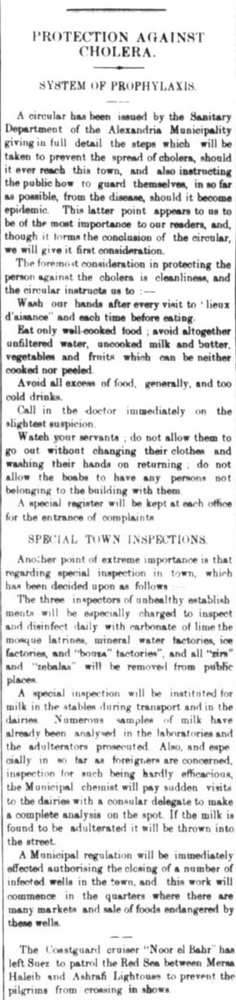

An article in my January 30th, 1908 issue of the _Egyptian Gazette_, "Protection Against Cholera" speaks on the Alexandria Sanitation Department issuing a statement on what steps they will take to stop the spread of cholera.  I find this interesting because when an outbreak of anything happens today, the CDC for example, might send out a similar statement.  

Insert text here in Markdown format.

If you want to include other images, add the image file to the folder containing this file, and use this format:

